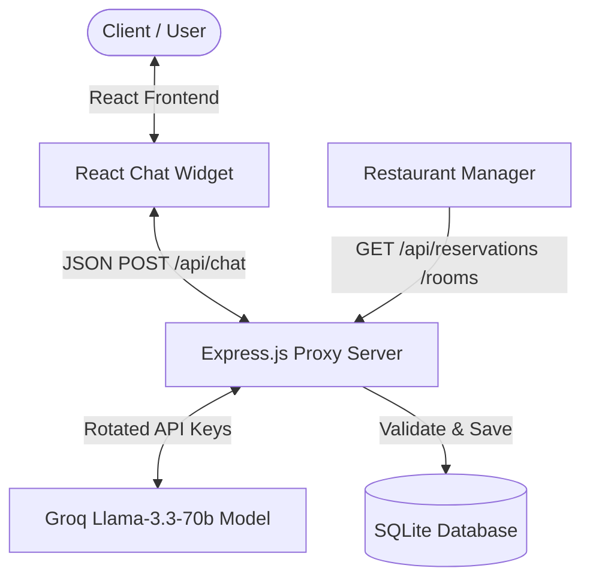

#  L'Alsacien République - AI-Powered Chatbot & Reservation System

An intelligent, full-stack conversational chatbot and reservation system built for **L'Alsacien République**, a popular Alsatian restaurant and Flammekueche bar in Paris. The project automates customer support, processes reservations (both for small tables and private room requests), validates opening hours and venue capacity in real time, and persists bookings in a database.

---

##  System Architecture

The project consists of three main components:
1. **Frontend (React)**: An interactive floating chat widget (`LAlsacienWidget`) allowing customers to chat seamlessly with Lola (the AI assistant).
2. **Backend (Node.js & Express)**: An orchestration proxy that handles chat history, rotates Groq API keys to ensure high availability, hosts the System Prompt, validates business rules, and extracts structured data.
3. **Database (SQLite)**: A persistent storage layer using `better-sqlite3` storing all table reservations and room requests.



---

##  Key Features

### 1. Conversational AI Assistant (Lola)
* **Context-Aware Conversations**: Lola is configured to match the friendly, loud, and social biergarten atmosphere of L'Alsacien.
* **Multilingual**: Dynamically responds in the language chosen by the customer (French, English, etc.).
* **Context Restriction**: Warmly redirects any off-topic questions (e.g., coding, general knowledge) back to the restaurant's services.

### 2. Intelligent Reservation Workflows
The assistant collects information step-by-step to handle two types of booking requests:
* **Standard Table Reservations**: Collects first name, last name, phone, email, date, time, and party size.
* **Private Room / Venue Privatization**: Details vaulted cellars, upstairs rooms, and minimum spends, then requests contact information and event descriptions for the management team.

### 3. Real-Time Business Rules & Validation
* **Operating Hours Verification**: Rejects reservation requests outside opening hours (e.g., afternoon breaks or late-night kitchen closures) and proposes the closest valid timeslot.
* **Capacity Conflicts**: Checks the SQLite database to ensure the restaurant capacity limit (maximum 60 guests per slot) is not exceeded before confirming.
* **Menu Suggestions**: Automatically flags groups of 8+ people and introduces the special €18/person unlimited Flammekueche menu.

### 4. Intent & JSON Extraction
Once booking information is gathered, Lola outputs a structured tag (e.g. `RESERVE_TABLE:{...}` or `RESERVE_ROOM:{...}`). The backend interceptor parses this JSON, runs verification checks, updates the database, and responds with formatted booking confirmations.

### 5. High Availability & API Key Rotation
To prevent service disruptions from rate limits (HTTP 429) or quota exhausts, the Express server detects all environment keys prefixed with `GROQ_API_KEY` (e.g. `GROQ_API_KEY_1`, `GROQ_API_KEY_2`) and automatically rotates requests through active keys.

---

##  Project Directory Structure

```text
├── AutoApplyBot/          # Automated application scripts & scraping tools
├── public/                # Static assets for React
├── src/
│   ├── App.js             # React Chat Widget Component & State management
│   ├── App.css            # Styles for chat window, bubbles, and loader animations
│   ├── index.js           # React app entry point
│   ├── proxy.js           # Express server: LLM integration, key rotation, and parsing logic
│   ├── db.js              # Database helper methods using better-sqlite3
│   └── reservations.db    # SQLite database file storing reservations on disk
├── .env                   # Local configuration for API keys and server variables
├── package.json           # Project dependencies and script declarations
└── README.md              # Project documentation
```

---

##  Database Schema

The database uses SQLite to persist data across two main tables:

### `table_reservations`
* `id` (INTEGER, Primary Key)
* `first_name` (TEXT, Not Null)
* `last_name` (TEXT, Not Null)
* `phone` (TEXT, Not Null)
* `email` (TEXT, Not Null)
* `date` (TEXT, Not Null)
* `time` (TEXT, Not Null)
* `party_size` (INTEGER, Not Null)
* `created_at` (DATETIME, Default: Current Timestamp)

### `room_requests`
* `id` (INTEGER, Primary Key)
* `first_name` (TEXT, Not Null)
* `last_name` (TEXT, Not Null)
* `phone` (TEXT, Not Null)
* `email` (TEXT, Not Null)
* `event_type` (TEXT)
* `created_at` (DATETIME, Default: Current Timestamp)

---

##  Setup & Installation

### Prerequisites
* **Node.js** (v18 or higher recommended)
* One or more active **Groq API Keys**

### 1. Clone the repository and install dependencies
```bash
npm install
```

### 2. Configure Environment Variables
Create a `.env` file in the root directory:
```env
# Port configuration
PORT=3001

# Groq API Keys (rotated automatically for rate limit management)
GROQ_API_KEY_1=gsk_yourkeyhere1...
GROQ_API_KEY_2=gsk_yourkeyhere2...
```

### 3. Run the application

Start the Express backend server:
```bash
node src/proxy.js
```

In a separate terminal, start the React development server:
```bash
npm start
```

Open [http://localhost:3000](http://localhost:3000) in your browser to view and interact with the application.

---

##  API Endpoints

* **POST** `/api/chat`: Processes conversation flows, validates data, and processes commands.
* **GET** `/api/reservations`: Returns all table reservations stored in the database.
* **GET** `/api/rooms`: Returns all private room and venue privatization requests.
